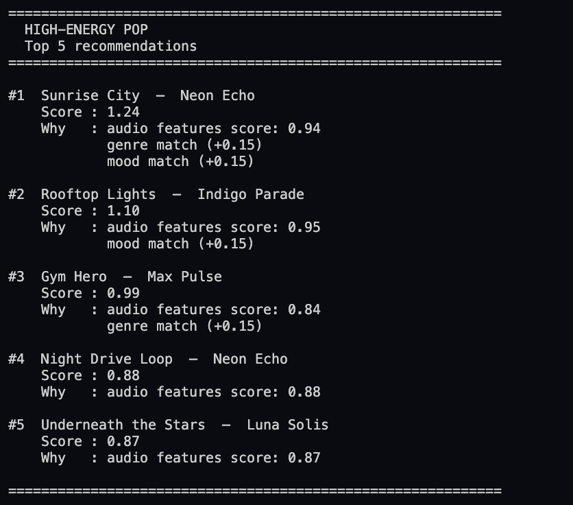
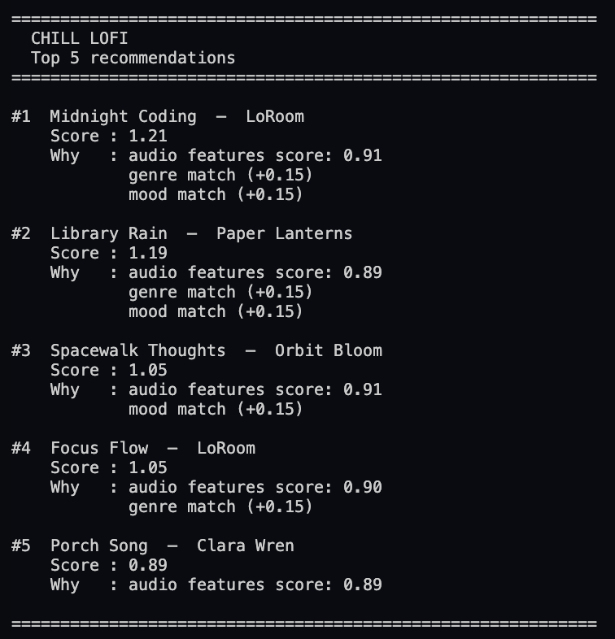
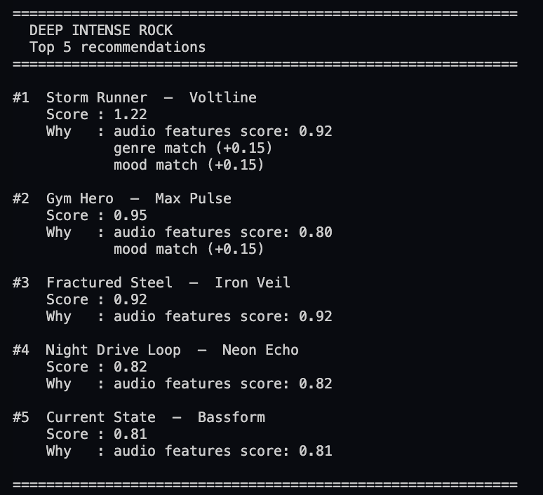
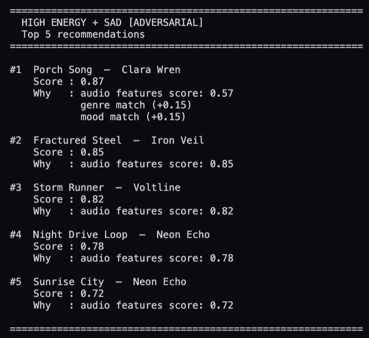
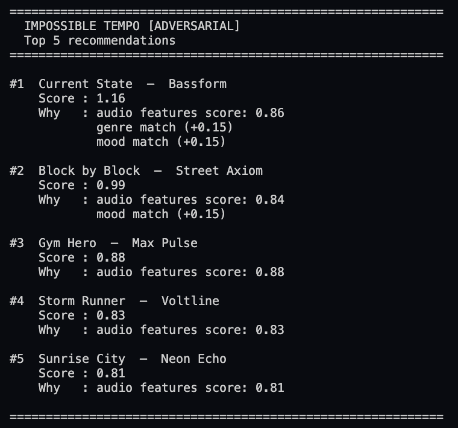
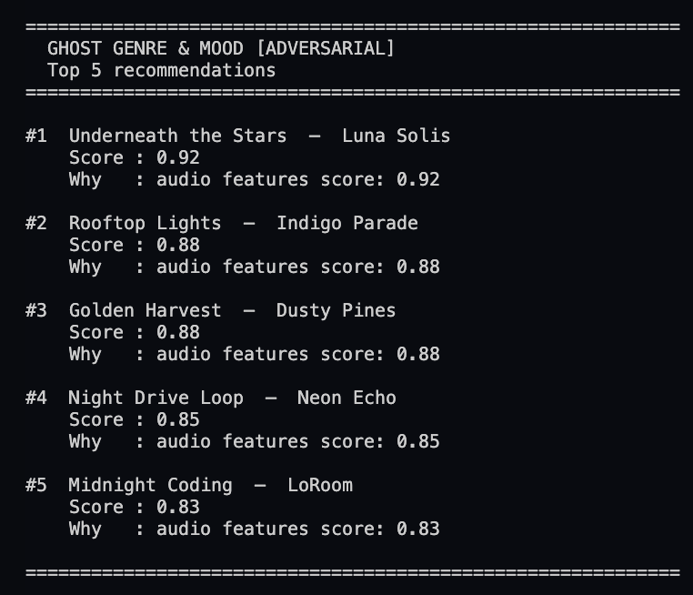
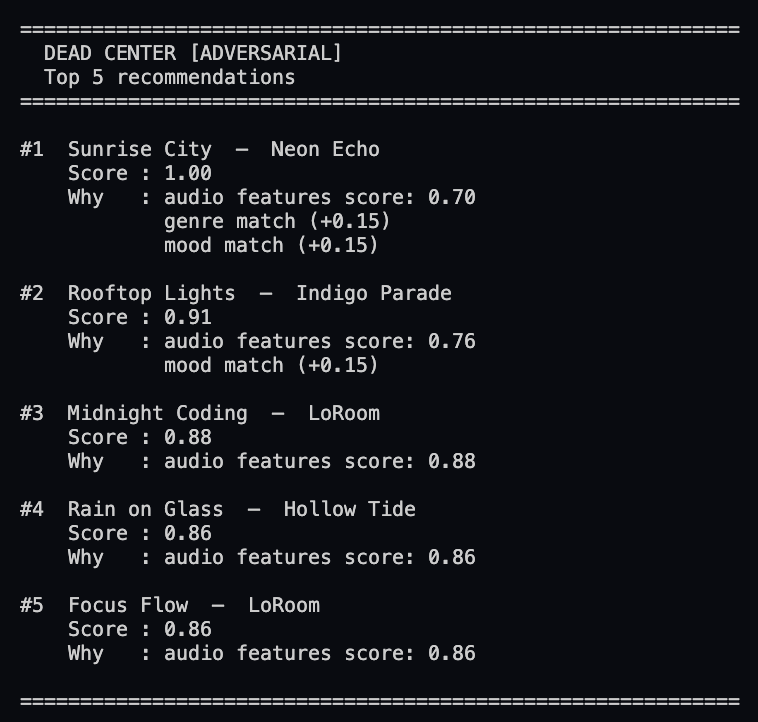
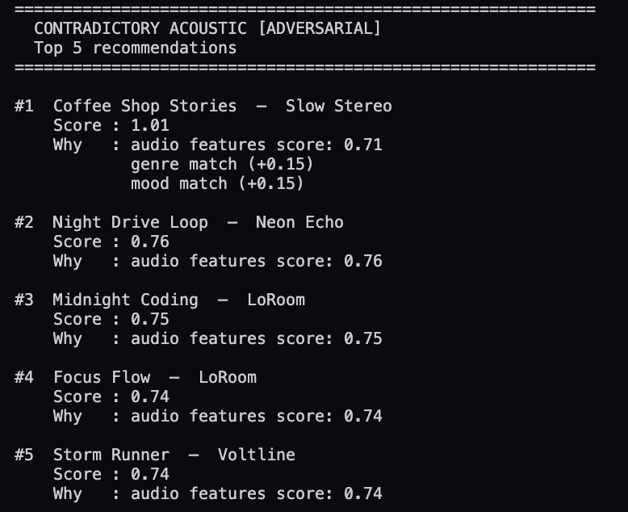

# 🎵 Music Recommender Simulation

## Project Summary

In this project you will build and explain a small music recommender system.

Your goal is to:

- Represent songs and a user "taste profile" as data
- Design a scoring rule that turns that data into recommendations
- Evaluate what your system gets right and wrong
- Reflect on how this mirrors real world AI recommenders

Replace this paragraph with your own summary of what your version does.

---

## How The System Works

Explain your design in plain language.

Some prompts to answer:

- What features does each `Song` use in your system
  - For example: genre, mood, energy, tempo
- What information does your `UserProfile` store
- How does your `Recommender` compute a score for each song
- How do you choose which songs to recommend

You can include a simple diagram or bullet list if helpful.

- My design will calculate a numeric score for each song based on how closely its audio features match the user's targets, then add flat bonuses for categorical matches. A score of 1.0 or higher indicates a really good match. I plan to calculate the score using the following formula: 
```
numeric_score = (w1 × proximity(energy)
              + w2 × proximity(acousticness)
              + w3 × proximity(valence)
              + w4 × proximity(danceability)
              + w5 × proximity(tempo_normalized)
              ) / (w1 + w2 + w3 + w4 + w5)

total_score = numeric_score
            + 0.15  (if genre matches favorite_genre)
            + 0.15  (if mood  matches favorite_mood)

# genre and mood are strings — they can't be "close", only equal or not,
# so they are treated as flat bonuses rather than weighted numeric features.

WEIGHTS = {
    "energy":        0.25,  # strongest discriminator in this dataset
    "acousticness":  0.25,  # captures organic vs electronic texture
    "valence":       0.20,  # emotional tone
    "danceability":  0.20,  # rhythmic feel and movement
    "tempo":         0.10,  # pace (normalized: tempo_bpm / 200)
}
```
- Each song stores identifying information (id, title, artist), categorical descriptors (genre, mood), and five numeric audio features (energy, tempo_bpm, valence, danceability, acousticness) that together capture what a song sounds like and feels like.
- Songs will then be ordered based on their total score. Scores at or above 1.0 indicate a strong match; scores below 1.0 mean the song aligns partially.
- The UserProfile stores four pieces of information about a user's music taste. 
  - It records the user's favorite_genre and favorite_mood as strings, which capture categorical preferences like preferring "lofi" or "jazz" and moods like "chill" or "focused." 
  - It also stores target_energy as a float between 0 and 1, representing the energy level the user gravitates toward (closer to 0 for mellow listening and closer to 1 for high-intensity music). 
  - Finally, likes_acoustic is a boolean that indicates whether the user prefers acoustic, organic-sounding songs over electronic or produced ones.
- **Potential Biases:** the numeric portion prioritizes energy and acousticness. The categorical bonuses treat genre and mood as equally important to each other but less influential than a perfect numeric match across all features.

Here is my planned flow chart: 
```
flowchart TD
    A([Input: user_prefs\nfavorite_genre · favorite_mood · target_energy\ntarget_acousticness · target_valence\ntarget_danceability · target_tempo_bpm]) --> B[load_songs from data/songs.csv]
    B --> C

    subgraph C[recommend_songs loop — for each song]
        D[proximity energy\nw1 = 0.25]
        E[proximity acousticness\nw2 = 0.25]
        F[proximity valence\nw3 = 0.20]
        G[proximity danceability\nw4 = 0.20]
        H[proximity tempo normalized\nw5 = 0.10]
        D & E & F & G & H --> J[weighted sum ÷ total weight\n= numeric_score 0.0–1.0]
        J --> J2[+ 0.15 if genre matches\n+ 0.15 if mood matches]
        J2 --> K[store song · total_score · explanation]
    end

    C --> L[sort all songs by total_score descending]
    L --> M[slice top K]
    M --> N([Output: title · score · explanation])

```


---

## Getting Started

### Setup

1. Create a virtual environment (optional but recommended):

   ```bash
   python -m venv .venv
   source .venv/bin/activate      # Mac or Linux
   .venv\Scripts\activate         # Windows

2. Install dependencies

```bash
pip install -r requirements.txt
```

3. Run the app:

```bash
python -m src.main
```

### Running Tests

Run the starter tests with:

```bash
pytest
```

You can add more tests in `tests/test_recommender.py`.

---


## Experiments You Tried










Use this section to document the experiments you ran. For example:

- What happened when you changed the weight on genre from 2.0 to 0.5
- What happened when you added tempo or valence to the score
- How did your system behave for different types of users

---

## Limitations and Risks

Summarize some limitations of your recommender.

Examples:

- It only works on a tiny catalog
- It does not understand lyrics or language
- It might over favor one genre or mood

You will go deeper on this in your model card.

---

## Reflection

Read and complete `model_card.md`:

[**Model Card**](model_card.md)

Write 1 to 2 paragraphs here about what you learned:

- about how recommenders turn data into predictions
- about where bias or unfairness could show up in systems like this


---

## 7. `model_card_template.md`

Combines reflection and model card framing from the Module 3 guidance. :contentReference[oaicite:2]{index=2}  

```markdown
# 🎧 Model Card - Music Recommender Simulation

## 1. Model Name

Give your recommender a name, for example:

> VibeFinder 1.0

---

## 2. Intended Use

- What is this system trying to do
- Who is it for

Example:

> This model suggests 3 to 5 songs from a small catalog based on a user's preferred genre, mood, and energy level. It is for classroom exploration only, not for real users.

---

## 3. How It Works (Short Explanation)

Describe your scoring logic in plain language.

- What features of each song does it consider
- What information about the user does it use
- How does it turn those into a number

Try to avoid code in this section, treat it like an explanation to a non programmer.

---

## 4. Data

Describe your dataset.

- How many songs are in `data/songs.csv`
- Did you add or remove any songs
- What kinds of genres or moods are represented
- Whose taste does this data mostly reflect

---

## 5. Strengths

Where does your recommender work well

You can think about:
- Situations where the top results "felt right"
- Particular user profiles it served well
- Simplicity or transparency benefits

---

## 6. Limitations and Bias

Where does your recommender struggle

Some prompts:
- Does it ignore some genres or moods
- Does it treat all users as if they have the same taste shape
- Is it biased toward high energy or one genre by default
- How could this be unfair if used in a real product

---

## 7. Evaluation

How did you check your system

Examples:
- You tried multiple user profiles and wrote down whether the results matched your expectations
- You compared your simulation to what a real app like Spotify or YouTube tends to recommend
- You wrote tests for your scoring logic

You do not need a numeric metric, but if you used one, explain what it measures.

---

## 8. Future Work

If you had more time, how would you improve this recommender

Examples:

- Add support for multiple users and "group vibe" recommendations
- Balance diversity of songs instead of always picking the closest match
- Use more features, like tempo ranges or lyric themes

---

## 9. Personal Reflection

A few sentences about what you learned:

- What surprised you about how your system behaved
- How did building this change how you think about real music recommenders
- Where do you think human judgment still matters, even if the model seems "smart"

